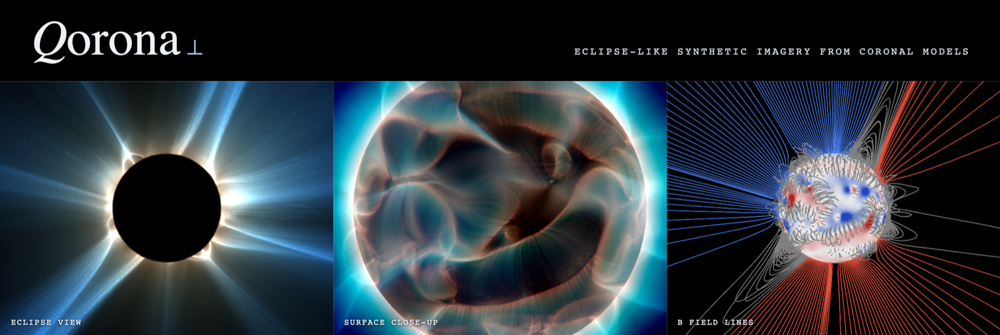

Qorona turns a global coronal **MHD solution** into **eclipse-like synthetic imagery**. Its primary
product is a line-of-sight integral of the magnetic **squashing factor Q⊥**, the quantity that lights
up the thin loops, streamers, and current sheets seen at a total solar eclipse. The result is
rendered for morphological comparison against eclipse and coronagraph observations.

```
coronal MHD solution ──▶ read ──▶ resample ──▶ Q⊥ volume ──▶ LOS render ──▶ synthetic eclipse image
```

## Install

```bash
conda env create -f environment.yml
conda activate qorona
```

This creates the `qorona` environment and installs the package (editable) with the `qorona` command.
The default install is the **full toolset**: every feature works out of the box, including
numba-accelerated builds and renders and the on-image provenance stamp (Pillow).

### Minimal install (advanced, optional)

Two dependencies have graceful fallbacks and can be left out for a smaller footprint. Qorona detects
their absence and degrades automatically, so this is an off-road choice, not the default:

- **numba**: drop for a pure-NumPy build/render (identical output, much slower).
- **pillow**: drop to skip the on-image stamp (the run still completes and prints its provenance).

```bash
pip install qorona --no-deps
pip install numpy scipy astropy sunpy rich click   # hard core; add back numba / pillow as wanted
```

## Example data

The quickstart uses `hmi_lmax50.CFmesh.xz` (~165 MB), an HMI-driven COCONUT corona MHD solution.
It is distributed as a [release asset](../../releases/tag/v0.1.0), not committed to the repo: download it
into `data/` before running the commands below. Qorona reads the compressed `.xz` directly, with no
manual decompression step.

## Quickstart

Qorona splits the pipeline at its natural cost seam: the **Q⊥ volume is expensive and
viewpoint-independent** (bake it once), while a **render off that volume is cheap** (do it for many
cameras). Three commands follow from that:

```bash
# 1. Inspect a solution (model, mesh, variables, boundaries), no rendering.
qorona info data/hmi_lmax50.CFmesh.xz --timestamp 2025-10-09T18:19:52

# 2. Bake the viewpoint-independent Q⊥ volume once (the minutes-scale stage).
qorona build data/hmi_lmax50.CFmesh.xz -o data/hmi_lmax50.qor \
    --timestamp 2025-10-09T18:19:52 --outer-radius 8

# 3. Render any number of viewpoints off that volume (seconds each).
qorona render data/hmi_lmax50.qor -o data/eclipse.png --fov 8 --longitude 317
qorona render data/hmi_lmax50.qor -o data/polarity.png --fov 8 --longitude 317 --polarity-mode hue
qorona render data/hmi_lmax50.qor -o data/sun.png --fov 3 --longitude 317 --occult opaque --preset small-fov --step 0.002
```

Or do it all in one shot:

```bash
qorona run data/hmi_lmax50.CFmesh.xz -o data/eclipse.png \
    --timestamp 2025-10-09T18:19:52 --fov 8 --longitude 317 --save-volume data/hmi_lmax50.qor
```

For a field-line view:

```bash
qorona fieldlines data/hmi_lmax50.CFmesh.xz -o data/fieldlines.png --fov 8 --longitude 317
```

Every command prints a polished end-of-run summary of its parameters and metrics, and the rendered
PNG carries a corner stamp (CR · timestamp · sub-observer angles · roll · FOV) for reproducibility. Run
`qorona <command> --help` for the full flag list (grid resolution, builder, weighting preset,
occultation, display mode, and more); the defaults reproduce the published whole-corona Q⊥ render.

## GPU acceleration

Volume builds are CUDA-accelerated end to end, with no extra Qorona dependency: the kernels ride
the default-install numba and activate whenever it sees a CUDA-capable NVIDIA GPU (driver + CUDA
toolkit). Nothing to configure: `qorona build` already uses the GPU when one is present.

```bash
qorona build ... --device gpu                       # force the GPU (errors if none is usable)
qorona build ... --device cpu                       # multi-core CPU path (the reference)
qorona build ... --device gpu --precision float64   # all-double reference (~2× slower than mixed)
```

- `--device auto` (default) picks the GPU when present; the CPU kernels remain the reference
  implementation and produce the same images.
- `--precision mixed` (default) runs the field interpolation in float32 and everything else in
  float64, log-invisible against the `float64` reference. `float32` is an experimental fully-float32
  paint variant. GPU-only knob; the CPU path always computes in float64.
- Device memory adapts to free VRAM (the Q⊥ accumulation tiles itself), so the same command runs
  on small cards and at very high resolutions alike.
- The resolved backend and precision are stamped into the volume's provenance and the end-of-run
  summary.

Indicative volume-build timings (RTX 4080 vs 32-core CPU, mixed precision; not a benchmark):

| Q⊥ volume                            | GPU    | CPU            |
|--------------------------------------|--------|----------------|
| Quickstart, 384×360×720 (100 M vox)  | ~75 s  | ~9 min         |
| High-res, 512×800×1600 (655 M vox)   | ~3 min | not practical  |

## How it works

The pipeline processes a single MHD snapshot through four stages, each isolated behind a clean
interface so a new input model is added by writing one reader and a new viewpoint costs only a
render:

1. **Read & resample** the native solution onto an internal regular spherical grid.
2. **Trace** magnetic field lines and **transport** deviation vectors along them.
3. **Squashing factor**: assemble Q⊥ boundary-to-boundary and bake it into a viewpoint-independent
   volume (cached to a dependency-free `.qor`).
4. **Render**: integrate log₁₀ Q⊥ along the line of sight on an orthographic plane-of-sky camera,
   with depth colouring and eclipse occultation.

The reference output is the line-of-sight squashing-factor render of the corona's fine structure.

## Supported models

Qorona is model-agnostic: each coronal model and file format sits behind a common reader interface,
so the whole pipeline runs on any solution once a reader exists.

**Currently supported:** COCONUT (COOLFluiD `.CFmesh`).

Support for other coronal MHD models can be added by writing a single reader against that interface.
A contributor guide is planned.

## License

GPL-3.0-or-later. See [`LICENSE`](LICENSE).
