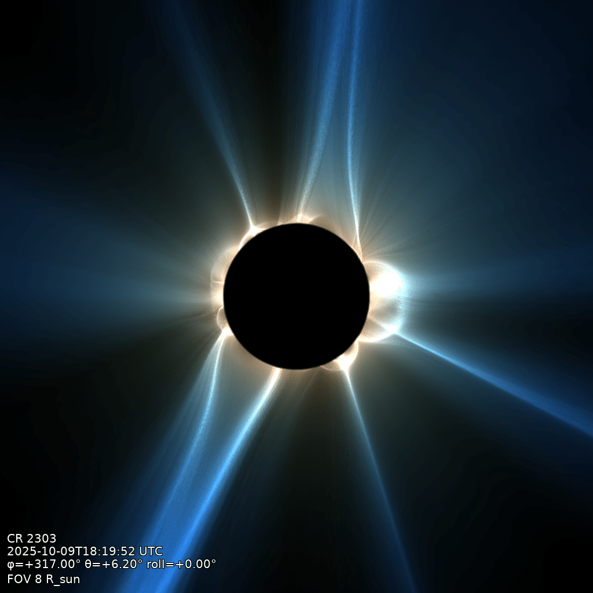

# First eclipse image

Three commands take a fresh solution to a synthetic eclipse render. They follow the pipeline's
natural cost seam: the Q⊥ volume is expensive and viewpoint-independent, so it is built once;
a render off that volume is cheap, so it is done for as many cameras as wanted.

This walkthrough uses the [example data](example-data.md), `data/coconut_corona.CFmesh.xz`.

## 1. Inspect

```bash
qorona info data/coconut_corona.CFmesh.xz --timestamp 2025-10-09T18:19:52
```

`info` reads the solution and reports what Qorona sees: model, mesh, variables, boundaries.
Nothing is rendered; use it to confirm a file is understood before spending minutes on a build.

## 2. Build the Q⊥ volume

```bash
qorona build data/coconut_corona.CFmesh.xz -o data/coconut_corona.qor \
    --timestamp 2025-10-09T18:19:52 --outer-radius 8
```

The minutes-scale stage: trace the field, assemble Q⊥, and cache it to `coconut_corona.qor`. At
the default `standard` quality this is about 85 seconds on an RTX 4080 or about 9 minutes on a
32-core CPU; `--quality fast` gives a minute-scale preview. `--quality fast|standard|high`
picks the volume resolution, and `--outer-radius` sets how far out the volume extends, in
solar radii; the [Q⊥ volume page](../qperp-volume.md) covers both. `--timestamp` is optional
(it drives the on-image Carrington-rotation stamp).

## 3. Render

```bash
qorona render data/coconut_corona.qor -o data/eclipse.png --fov 8 --longitude 317 --latitude 6.2
```

Seconds per viewpoint, any number of viewpoints off the one volume. `--fov` is the field of
view (full width) in solar radii; `--longitude` and `--latitude` set the sub-observer
heliographic point, `--roll` the camera roll.

The figure below is exactly this render:



## What you get

Every command ends with a summary of its parameters and metrics, and the PNG carries a corner
stamp (Carrington rotation, timestamp, sub-observer angles, roll, FOV), so any image can be
traced back to what produced it.

`qorona run` chains the whole pipeline in one shot; `--save-volume` keeps the intermediate so
later renders are instant:

```bash
qorona run data/coconut_corona.CFmesh.xz -o data/eclipse.png \
    --timestamp 2025-10-09T18:19:52 --fov 8 --longitude 317 --save-volume data/coconut_corona.qor
```

## Next

One page per product: [squashing-factor render](../products/squashing-factor.md),
[polarity view](../products/polarity.md), [white-light imaging](../products/white-light.md),
[Q-maps](../products/qmaps.md), [field lines](../products/fieldlines.md).
