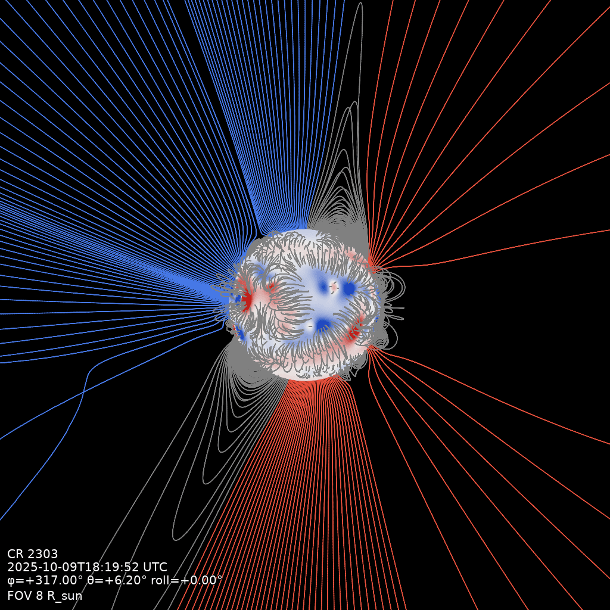

# Field lines

A traced field-line view of the solution: a bundle of lines drawn in projection over the
photosphere disk. The default look follows an eclipse photograph: the open fan seeded on the
limb, short closed loops on the front face, lines coloured by the polarity of their inner
foot, and the disk rendered as a B_r magnetogram from the data. Self-contained: it traces the
field directly and does not use a built volume.



```bash
qorona fieldlines data/coconut_corona.CFmesh.xz -o data/fieldlines.png \
    --timestamp 2025-10-09T18:19:52 --fov 8 --longitude 317 --latitude 6.2 --seeds 1650
```

## The flags that matter

- `--seeding limb|uniform`: limb (front loops plus the open limb fan, the default) or a
  uniform sphere; `--seeds` and `--limb-seeds` set the budgets.
- `--colour polarity|rainbow`: line colour by inner-foot B_r sign (default) or per-line hue.
- `--magnetogram / --no-magnetogram`: the B_r disk (default on).
- `--show all|open|closed`: which lines to draw (default `all`).
- `--depth-fade`: dim far-side lines by up to this fraction (default 0.4).
- Camera flags are the same as the [squashing-factor render](squashing-factor.md).
