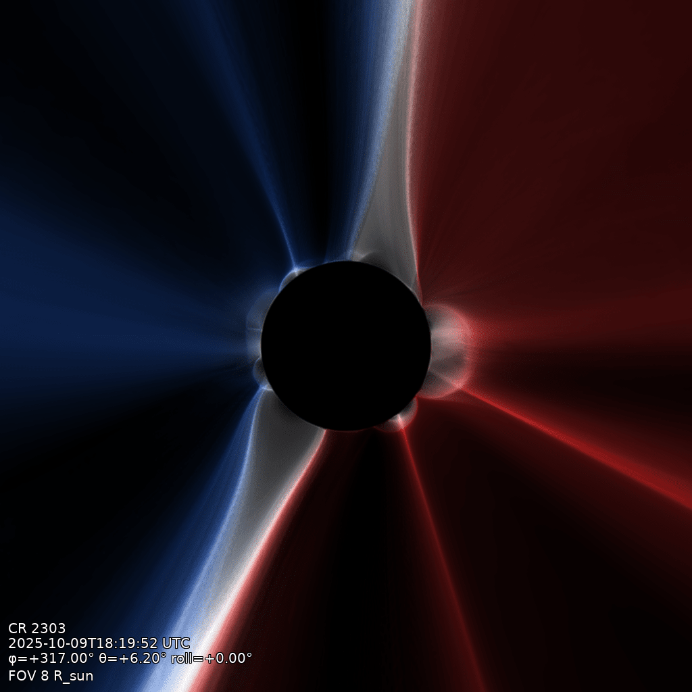

# Polarity view

The squashing-factor render coloured by magnetic polarity: `--polarity-mode hue` paints
outward field warm, inward field cool, and white where opposite polarities cancel along the
line of sight, so open-field cells of opposite sign and the current sheet between them are
read at a glance.



```bash
qorona render data/coconut_corona.qor -o docs/assets/polarity.png \
    --fov 8 --longitude 317 --latitude 6.2 --polarity-mode hue
```

## The flags that matter

- `--polarity-mode hue`: warm = outward, cool = inward; `none` (the default) is the plain
  render.
- The polarity sign is stored in the volume, and the closed-field treatment is chosen at
  build time: `qorona build --closed neutral|dominant` (default `neutral`, where the two feet
  of a closed loop cancel to zero).
- Camera and display flags are the same as the
  [squashing-factor render](squashing-factor.md).
