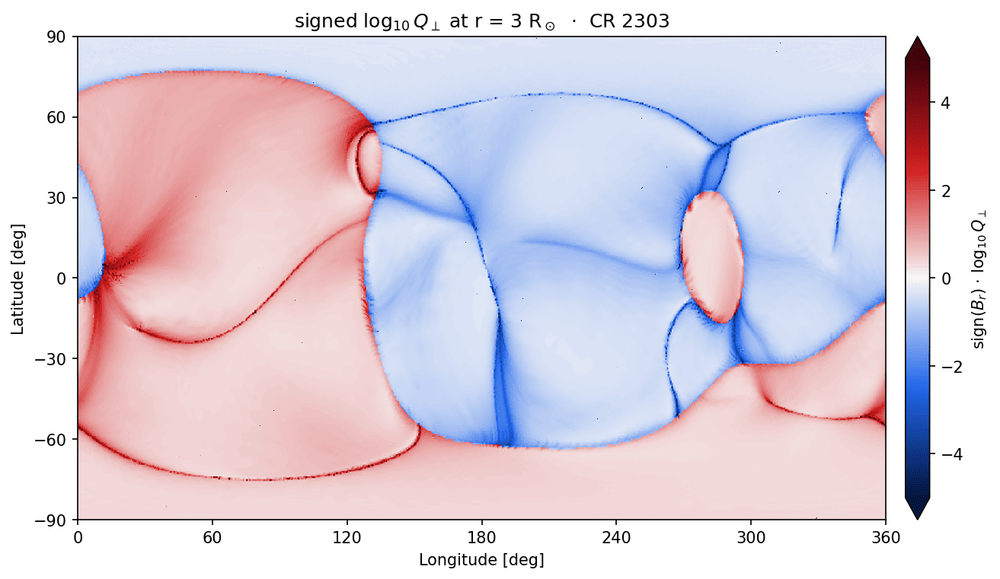

# Q-maps

A synoptic Q-map: signed-log₁₀ Q⊥ on a Carrington longitude/latitude grid at a fixed radius,
sliced from a built volume with no re-ingest or tracing; the viewpoint-independent sibling of
`render`. The displayed quantity is sign(B·r̂) · log₁₀ Q⊥, signed by the radial-field
polarity: the neutral line between the two colours traces the base of the heliospheric
current sheet, and the saturated ridges are the S-web arcs.

Build the volume with `--outer-radius` equal to the map radius, then slice:



```bash
qorona build data/coconut_corona.CFmesh.xz -o data/coconut_corona_or3.qor \
    --timestamp 2025-10-09T18:19:52 --outer-radius 3
qorona qmap data/coconut_corona_or3.qor -o docs/assets/qmap.png --radius 3
```

## The flags that matter

- `--radius`: shell radius in solar radii (default 3).
- `--resolution NTHETAxNPHI`: display grid (default 720x1440; interpolated, capped by the
  build's pitch).
- `--slog-max`: colour ceiling for the signed log (default 5).
- `--export-npz`: also write the raw shell arrays beside the figure.
