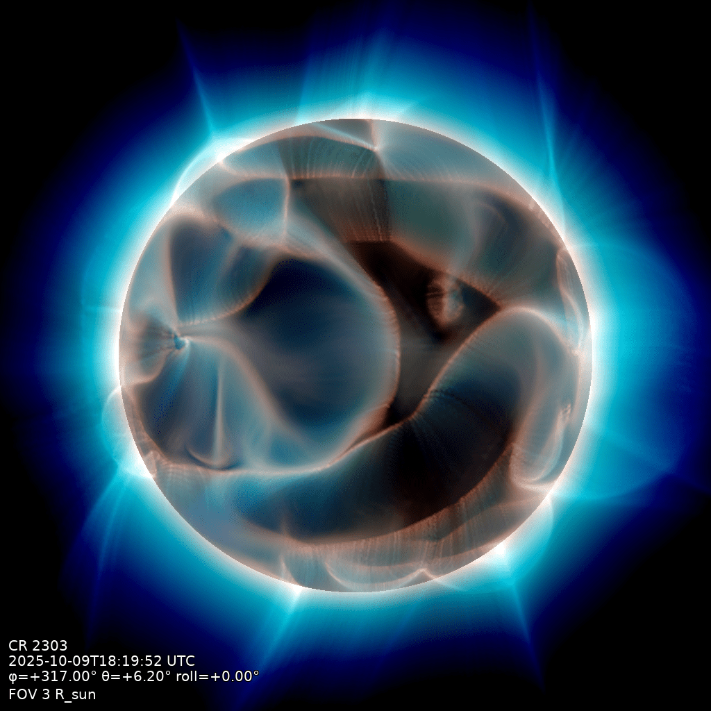
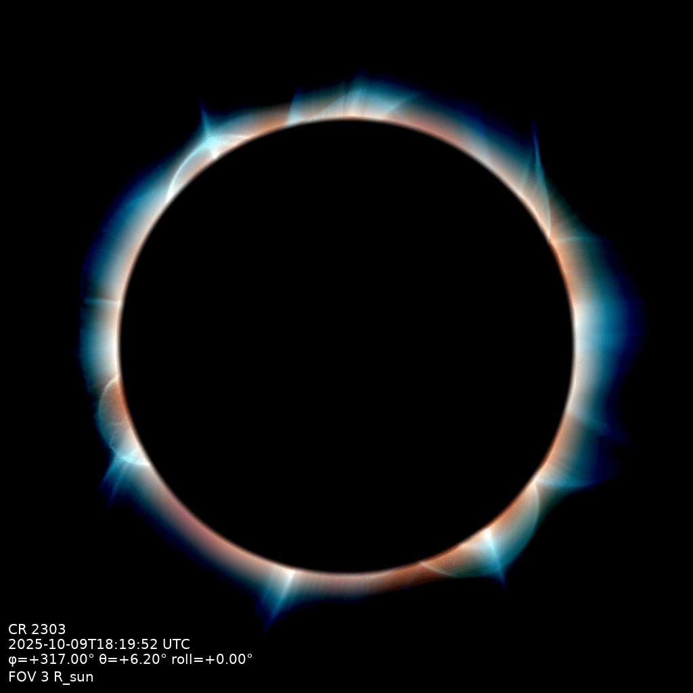
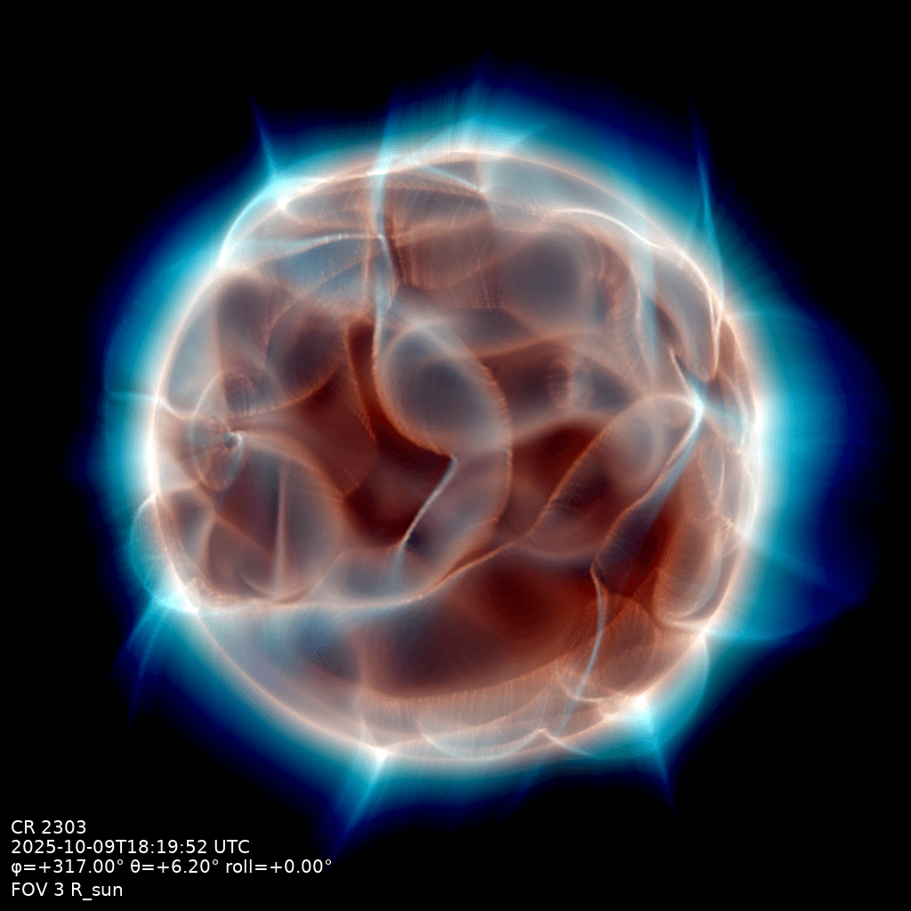
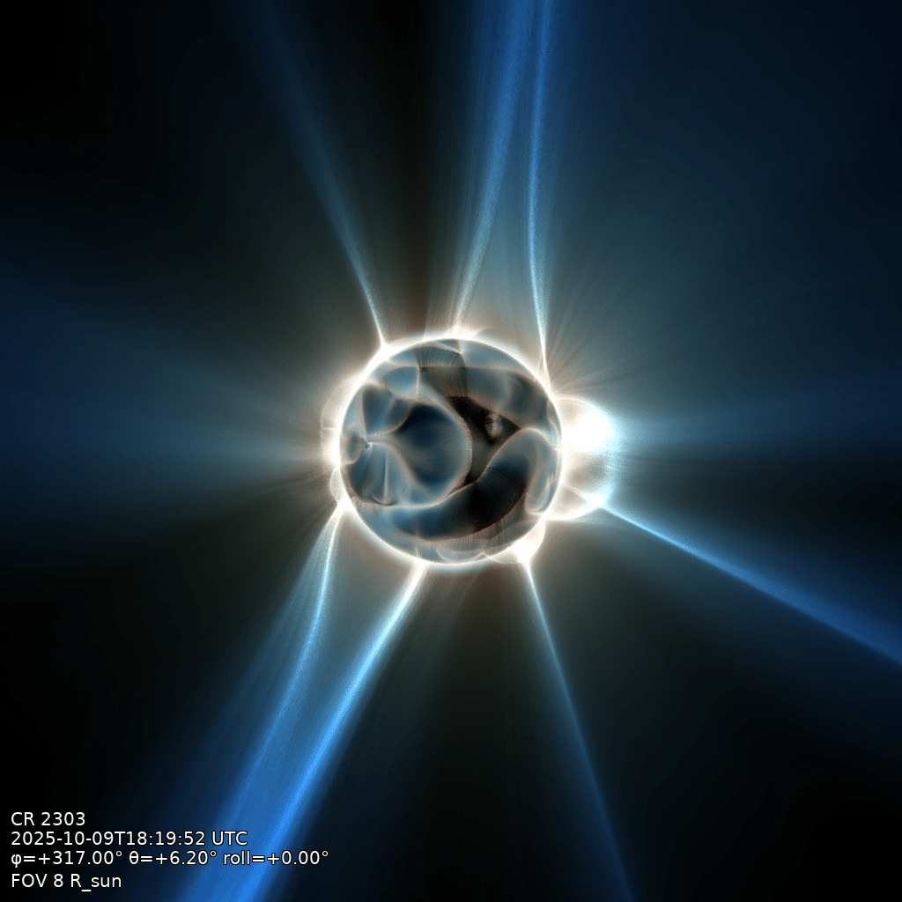

# Squashing-factor render

The primary product: the line-of-sight integral of log₁₀ Q⊥ through the built volume. Q⊥ is
the perpendicular squashing factor, the projection-robust variant of the classical Q; it is
large exactly where neighbouring field lines are pulled apart, in the quasi-separatrix
layers, and diverges at separatrices, so the integral renders the fine structure seen at a
total solar eclipse.


```bash
qorona render data/coconut_corona.qor -o data/eclipse.png --fov 8 --longitude 317 --latitude 6.2
```

## The flags that matter

- `--fov`: field of view (full width) in solar radii.
- `--longitude`, `--latitude`, `--roll`: sub-observer heliographic point and camera roll.
- `--occult`: the body treatment; see the occultation modes below.
- `--preset`: geometric depth weighting, `large-fov` or `small-fov` for the near-limb view
  (default `large-fov`).
- `--step`: line-of-sight sample spacing in solar radii (default 0.02).
- `--width`, `--height`: image size in pixels (default 1024).
- `--export fits`: also write the quantitative render (LOS-averaged log₁₀ Q⊥, float32,
  WCS-registered) beside the PNG; needs a timestamp. Drop the file into
  [JHelioviewer](https://www.jhelioviewer.org) and it registers at the correct scale,
  orientation, position, and time for overlay on observed imagery; `sunpy.map.Map` reads
  the same registration for scripted analysis. `--observer earth` points the camera from
  the real Earth viewpoint
  at that epoch, so the overlay matches Earth-based observations exactly; the registration
  assumes a Carrington-aligned solution frame (the case for synoptic-driven runs). With
  `--occult composite` the FITS fills the disk with the near-side surface Q; with the
  default eclipse occulter the disk stays NaN (transparent in JHelioviewer, so real disk
  imagery shows through).

`qorona render --help` shows the common options, `--help-all` the complete reference (display
clamp, stretch percentiles, stamp placement, and more).

## Near-limb view

Closing in on the low corona is a setting, not a different product: a small field of view
with the matching depth weighting, `--fov 3 --preset small-fov`. This sun view uses the opaque
body (`--occult opaque`) so the disk shows its surface Q⊥ structure rather than a dark eclipse
disk.



```bash
qorona render data/coconut_corona.qor -o data/near-limb.png \
    --fov 3 --longitude 317 --latitude 6.2 --preset small-fov --step 0.002 --occult opaque
```

!!! warning "Small fields of view need a fine step"
    The default `--step 0.02` is matched to whole-corona views. Close in, thin sheets alias
    at that spacing: drop to `--step 0.002`.

## Occultation modes

`--occult` picks the treatment of the solar body: `opaque` (the solid 3-D body, shown in the
near-limb view above), `eclipse` (the dark disk, the default), `none` (no body at all; the
integral runs through the whole volume), and `composite` (below). At the whole-corona scale
the disk is small and the modes look alike, so `eclipse` and `none` are compared here at the
same near-limb setting as the opaque view above:

| `eclipse` (default) | `none` |
|---------------------|--------|
|  |  |

```bash
qorona render data/coconut_corona.qor -o data/occult-<mode>.png \
    --fov 3 --longitude 317 --latitude 6.2 --preset small-fov --step 0.002 --occult <mode>
```

`composite` is made for the whole-corona view: the eclipse image with the disk filled by the
near-limb view, toned down so the corona stays dominant; `--disk-tone` and `--disk-desat`
tune it.



```bash
qorona render data/coconut_corona.qor -o data/composite.png \
    --fov 8 --longitude 317 --latitude 6.2 --occult composite
```
