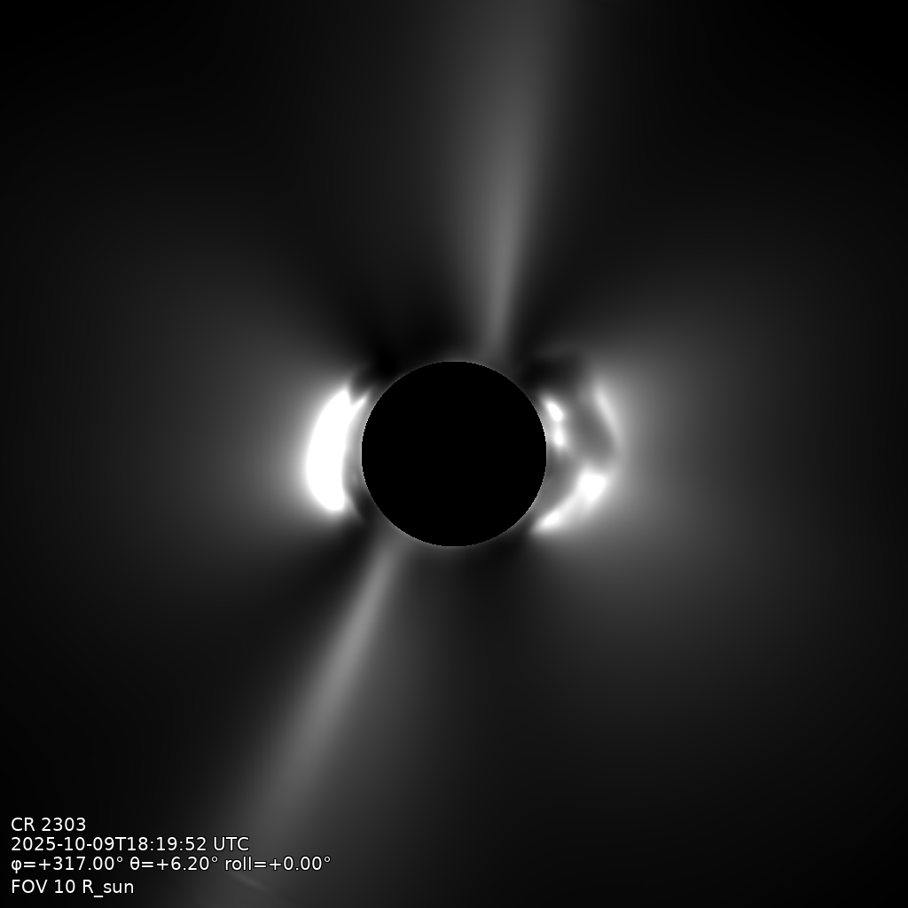

# White-light imaging

Thomson-scattered brightness integrated over the solution's electron density. The default
frame is pB, the polarized brightness: the linearly polarized component of the white-light
K-corona, and the classic coronagraph observable. `--frame total` selects the total brightness
instead. This is a density product; no Q⊥ volume is built or used.

The input is either a raw solution (read and resampled, as `build` would) or a built `.qor`
volume, whose stored density is reused, skipping the resample:



```bash
qorona wl data/coconut_corona.qor -o data/white-light.png \
    --longitude 317 --latitude 6.2
```

## The flags that matter

- `--frame polarized|total`: pB (the default) or the total white-light brightness.
- `--vignette newkirk|adaptive|wow|none`: display treatment of the frame. `newkirk` divides by
  the brightness of the smooth Newkirk background corona; `adaptive` self-calibrates the same
  curve family to the image's own falloff; `wow` whitens the raw frame's wavelet spectrum
  (Wavelets Optimized Whitening); `none` keeps the raw falloff. Default
  `newkirk` (`adaptive` for inputs whose radial falloff departs from it).
- `--percentiles LOW HIGH`: display stretch (default `1 99.5`; use `0 100` for the full
  untrimmed range).
- `--mgn`: optional fine-structure enhancement (multi-scale Gaussian normalization), applied
  last.
- `--occult eclipse|none`: the occulter (default `eclipse`).
- `--r-occult`: occulter radius in solar radii (default 1.02).
- `--export npz`: also write the raw frames (both pB and total, with plane-of-sky
  coordinates) beside the PNG.
- `--width`, `--height`: image size in pixels (default 1024, as for `render`).
- Camera flags are the same as the [squashing-factor render](squashing-factor.md); `wl`
  defaults to a wider `--fov 10` so the streamers keep headroom (the render keeps 8).

!!! note "Extra packages for `--vignette wow` and `--mgn`"
    These two treatments are backed by external enhancement libraries that are not part of
    the default install: both need [sunkit-image](https://docs.sunpy.org/projects/sunkit-image/),
    and WOW additionally needs [watroo](https://github.com/frederic-auchere/watroo), the wavelet
    library that implements the algorithm. Install them with `pip install sunkit-image watroo`
    (`watroo` is not on conda-forge). Requesting either treatment without its packages fails
    with the same instruction. On an HPC cluster, run that install on a login node before
    submitting, since compute nodes are usually offline.
